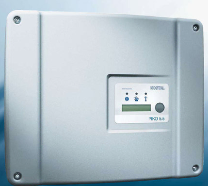

# ha-kostal-piko-esp


[![License][license-shield]][license]
[](https://github.com/zibous/ha-kostal-piko-esp/releases)
[![ESPHome release][esphome-release-shield]][esphome-release]
[![Open in Visual Studio Code][open-in-vscode-shield]][open-in-vscode]
[![Support author][donate-me-shield]][donate-me]


[license-shield]: https://img.shields.io/static/v1?label=License&message=MIT&color=orange&logo=license
[license]: https://opensource.org/licenses/MIT

[esphome-release-shield]: https://img.shields.io/static/v1?label=ESPHome&message=2023.5.5&color=green&logo=esphome
[esphome-release]: https://GitHub.com/esphome/esphome/releases/

[open-in-vscode-shield]: https://img.shields.io/static/v1?label=+&message=Open+in+VSCode&color=blue&logo=visualstudiocode
[open-in-vscode]: https://open.vscode.dev/zibous/zibous/ha-kostal-piko-esp

[donate-me-shield]: https://img.shields.io/static/v1?label=+&color=orange&message=Buy+me+a+coffee
[donate-me]: https://www.buymeacoff.ee/zibous


## Kostal Piko 5.5 Inverter, Dateprovider ESPHome ESP32 for Homeassistant

The ESPHome application loads the data from the Kostal PIKO 5.5 inverter at cyclic intervals, determines the characteristic values and calculates the historical data. The data are transferred via the Homeassistant API interface.


## Hardware

### Kostal Piko 5.5 Inverter


## Software
### DOCKER - Install ESPHOME

```bash
#!/bin/bash
# ---------------------------------------------
# sudo bash esphome.sh
# see: https://hub.docker.com/r/esphome/esphome
# ----------------------------------------------
IDu=$(id -u) # UID
IDg=$(id -g) # GID
CURRENTURL=http://$(hostname)
DOCKER_TIMEZONE=Europe/Berlin

DOCKER_APPSDIR=/apps/
DOCKER_TIMEZONE=Europe/Berlin
DOCKERIMAGE=esphome/esphome:latest
CONTAINERLABEL=esphome
APPSDATA=$PWD${DOCKER_APPSDIR}${CONTAINERLABEL}

echo "Create persistent data folder and log folder"
mkdir -p ${APPSDATA} 2>&1

echo "Try to remove previuos installation..."
docker stop ${CONTAINERLABEL} >/dev/null 2>&1
docker rm ${CONTAINERLABEL} >/dev/null 2>&1

echo "Install Docker container ${CONTAINERLABEL}."
docker run --detach \
  --name ${CONTAINERLABEL} \
  --privileged=true \
  --env TZ=${DOCKER_TIMEZONE} \
  --restart unless-stopped \
  --volume /run/udev:/run/udev \
  --volume /etc/localtime:/etc/localtime:ro \
  --volume ${APPSDATA}/config:/config \
  --network host \
  ${DOCKERIMAGE}

echo "Docker container ${CONTAINERLABEL} ready."
echo "Run WEBGUI: ${CURRENTURL}:6052"
```
<br>

### ESPHome Application
See Esphome configuration file `kostal-piko.yaml` for the application <br>
[](https://github.com/zibous/ha-kostal-pico/blob/master/esphome/config/kostal-piko.yaml)

<br>

## Preparation and creating the application
- Download the esphome config <https://download-directory.github.io/?url=https://github.com/zibous/ha-kostal-piko-esp/tree/main/esphome/config>
  
- Extract the zip archive and copy the files and directories to `/docker/app/esphome/config`
- Start Docker ESPHOME
- Create secrets.yaml based on `template_secrets.yaml` and adjust the entries
- Create and deploy the application to the connected device with the **esphome dashboard application** or with **ESPHome-Flasher utiltiy**.

<br>

### ESPHome-Flasher
ESPHome-Flasher is a utility app for the ESPHome framework and is designed to make flashing ESPs with ESPHome as simple as possible by:

    Having pre-built binaries for most operating systems.
    Hiding all non-essential options for flashing. All necessary options for flashing (bootloader, flash mode) are automatically extracted from the binary.

This project was originally intended to be a simple command-line tool, but then I decided that a GUI would be nice. As I don't like writing graphical front end code, the GUI largely is based on the NodeMCU PyFlasher project.
[Self-contained NodeMCU flasher with GUI based on esptool.py and wxPython](https://github.com/marcelstoer/nodemcu-pyflasher)


The flashing process is done using the esptool library by espressif.
[esphome-flasher, a tool to flash ESPs over USB](https://github.com/esphome/esphome-flasher)

<br>

