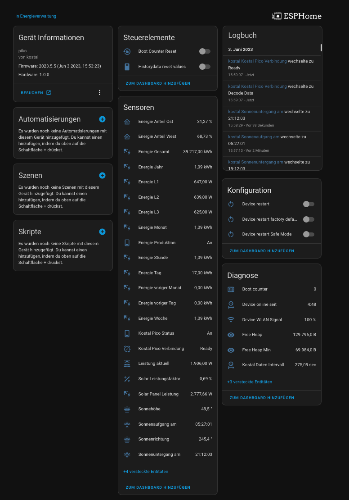

# KOSTAL PIKO 5.50 - ESPHome - ESP32 (v4) 

[![License][license-shield]][license]
[](https://github.com/zibous/ha-kostal-piko-esp/releases)
[![ESPHome release][esphome-release-shield]][esphome-release]
[![Open in Visual Studio Code][open-in-vscode-shield]][open-in-vscode]
[![Support author][donate-me-shield]][donate-me]


[license-shield]: https://img.shields.io/static/v1?label=License&message=MIT&color=orange&logo=license
[license]: https://opensource.org/licenses/MIT

[esphome-release-shield]: https://img.shields.io/static/v1?label=ESPHome&message=2023.5.5&color=green&logo=esphome
[esphome-release]: https://GitHub.com/esphome/esphome/releases/

[open-in-vscode-shield]: https://img.shields.io/static/v1?label=+&message=Open+in+VSCode&color=blue&logo=visualstudiocode
[open-in-vscode]: https://open.vscode.dev/zibous/zibous/ha-kostal-piko-esp

[donate-me-shield]: https://img.shields.io/static/v1?label=+&color=orange&message=Buy+me+a+coffee
[donate-me]: https://www.buymeacoff.ee/zibous

The ESPHome application loads the data from the Kostal PIKO 5.5 inverter at cyclic intervals, determines the characteristic values and calculates the historical data. The data are transferred via the Homeassistant API interface.

### Requirements
- **ESPHOME** on Docker v2023.5.0-dev
- **ESP32** 240MHz, 520KB RAM, 4MB Flash (ESP32 AZ-DELIVERY-DEVKIT-V4)
  
- **ESPHOME** Configuration<br>
  [](https://github.com/zibous/ha-kostal-piko-esp/blob/main/esphome/config/kostal-piko.yaml)
<br>

## TODO
 - find a better method to parse the html data custom_componet ???
 
   ```
	// get the data from the http request
	std::string data = id(http_request_data).get_string(); ## ??? memory leaks 
	
	if( !data.empty() ) {
	
	    id(kostal_webinterface_status).publish_state("Decode Data");
	
	    // kostal_aktuell: AC-Leistung_Aktuell Watt
	    size_t pos1 = data.find("aktuell</td>");
	    size_t pos2 = data.find("</td>", pos1 + 20);
	    std::string acLeistungAktuell = data.substr(pos1 + 65, pos2 - pos1 - 65);
	    float acLeistungAktuellFloat = 0.00;
	    if(acLeistungAktuell == "x x x&nbsp"){
	      ESP_LOGW("kostal", "Kostal is OFFLINE, AC-Leistung_Aktuell: %.2f", acLeistungAktuellFloat);
	    }else{
	      acLeistungAktuellFloat = std::stof(acLeistungAktuell);
	    }
	    id(kostal_aktuell).publish_state(acLeistungAktuellFloat);
	    ESP_LOGD("develop", "AC-Leistung_Aktuell: %.2f", acLeistungAktuellFloat);
	
	    // kostal_status: AC_Leistung_Status = Einspeisen MPP || Aus
	    pos1 = data.find("Status</td>");
	    pos2 = data.find("</td>", pos1 + 20);
	    std::string acLeistungStatus = data.substr(pos1 + 33, pos2 - pos1 - 33);
	    id(kostal_status).publish_state(acLeistungStatus);
	    ESP_LOGD("develop", "AC_Leistung_Status: %s", acLeistungStatus.c_str());
	
	    // kostal_total: Energie_Gesamtertrag kWh
	    pos1 = data.find("Gesamtenergie</td>");
	    pos2 = data.find("</td>", pos1 + 30);
	    std::string energieGesamtertrag = data.substr(pos1 + 70, pos2 - pos1 - 70);
	    float energieGesamtertragFloat = std::stof(energieGesamtertrag);
	    id(kostal_total).publish_state(energieGesamtertragFloat);
	    ESP_LOGD("develop", "Energie_Gesamtertrag: %.2f", energieGesamtertragFloat);
	
	    // kostal_day: Energie_Tagesertrag_Aktuell kWh
	    pos1 = data.find("Tagesenergie</td>");
	    pos2 = data.find("</td>", pos1 + 20);
	    std::string energieTagesertragAktuell = data.substr(pos1 + 70, pos2 - pos1 - 70);
	    float energieTagesertragAktuellFloat = std::stof(energieTagesertragAktuell);
	
	    // kostal_day: reset the kostal_day after midnight
	    if((id(time_sntp).now().hour>0.00 and id(time_sntp).now().hour<1.00) and acLeistungAktuellFloat==0.00){
	      energieTagesertragAktuellFloat = 0.00;
	    }
	    id(kostal_day).publish_state(energieTagesertragAktuellFloat);
	    ESP_LOGD("develop", "Energie_Tagesertrag_Aktuell: %.2f", energieTagesertragAktuellFloat);
	
	    if(id(kostal_aktuell).has_state() and id(kostal_aktuell).state > 0.00){
	
	        // PV_Generator_String1_Spannung Volt
	        pos1 = data.find("Spannung</td>", pos2);
	        pos2 = data.find("</td>", pos1 + 20);
	        std::string s1Volt = data.substr(pos1 + 66, pos2 - pos1 - 66);
	        float s1VoltFloat = std::stof(s1Volt);
	
	        // Ausgangsleistung_L1_Spannung Volt
	        pos1 = data.find("Spannung</td>", pos2);
	        pos2 = data.find("</td>", pos1 + 20);
	
	        // PV_Generator_String1_Strom Ampere
	        pos1 = data.find("Strom</td>", pos2);
	        pos2 = data.find("</td>", pos1 + 20);
	        std::string pvGeneratorString1Strom = data.substr(pos1 + 63, pos2 - pos1 - 63);
	        float pvGeneratorString1StromFloat = std::stof(pvGeneratorString1Strom);
	        ESP_LOGD("develop", "PV_Generator_String1_Strom: %.2f", pvGeneratorString1StromFloat);
	
	        // kostal_l1_power: Ausgangsleistung_L1_Leistung Watt
	        pos1 = data.find("Leistung</td>", pos2);
	        pos2 = data.find("</td>", pos1 + 20);
	        std::string pvGeneratorString1Power = data.substr(pos1 + 66, pos2 - pos1 - 66);
	        float pvGeneratorString1PowerFloat = std::stof(pvGeneratorString1Power);
	        id(kostal_l1_power).publish_state(pvGeneratorString1PowerFloat);
	        ESP_LOGD("develop", "Ausgangsleistung_L1_Leistung: %.2f", pvGeneratorString1PowerFloat);
	
	        // PV_Generator_String2_Spannung Volt
	        pos1 = data.find("Spannung</td>", pos2);
	        pos2 = data.find("</td>", pos1 + 20);
	        std::string s2Volt = data.substr(pos1 + 66, pos2 - pos1 - 66);
	        float s2VoltFloat = std::stof(s2Volt);
	        ESP_LOGD("develop", "PV_Generator_String2_Spannung: %.2f", s2VoltFloat);
	
	        // Ausgangsleistung_L2_Spannung Volt
	        pos1 = data.find("Spannung</td>", pos2);
	        pos2 = data.find("</td>", pos1 + 20);
	
	        // PV_Generator_String2_Strom Ampere
	        pos1 = data.find("Strom</td>", pos2);
	        pos2 = data.find("</td>", pos1 + 20);
	        std::string pvGeneratorString2Strom = data.substr(pos1 + 63, pos2 - pos1 - 63);
	        float pvGeneratorString2StromFloat = std::stof(pvGeneratorString2Strom);
	        ESP_LOGD("develop", "PV_Generator_String2_Strom: %.2f", pvGeneratorString2StromFloat);
	
	        // kostal_l2_power: Ausgangsleistung_L2_Leistung Watt
	        pos1 = data.find("Leistung</td>", pos2);
	        pos2 = data.find("</td>", pos1 + 20);
	        std::string pvGeneratorString2Power = data.substr(pos1 + 66, pos2 - pos1 - 66);
	        float pvGeneratorString2PowerFloat = std::stof(pvGeneratorString2Power);
	        id(kostal_l2_power).publish_state(pvGeneratorString2PowerFloat);
	        ESP_LOGD("develop", "Ausgangsleistung_L2_Leistung: %.2f", kostal_l2_power);
	
	        // PV_Generator_String3_Spannung Volt
	        pos1 = data.find("Spannung</td>", pos2);
	        pos2 = data.find("</td>", pos1 + 20);
	
	        // Ausgangsleistung_L3_Spannung Volt
	        pos1 = data.find("Spannung</td>", pos2);
	        pos2 = data.find("</td>", pos1 + 20);
	
	        // PV_Generator_String3_Strom Ampere
	        pos1 = data.find("Strom</td>", pos2);
	        pos2 = data.find("</td>", pos1 + 20);
	
	        // kostal_l3_power: Ausgangsleistung_L3_Leistung Watt
	        pos1 = data.find("Leistung</td>", pos2);
	        pos2 = data.find("</td>", pos1 + 20);
	        std::string pvGeneratorString3Power = data.substr(pos1 + 66, pos2 - pos1 - 66);
	        float pvGeneratorString3PowerFloat = std::stof(pvGeneratorString3Power);
	        id(kostal_l3_power).publish_state(pvGeneratorString3PowerFloat);
	        ESP_LOGD("develop", "Ausgangsleistung_L3_Leistung: %.2f", pvGeneratorString3PowerFloat);
	
	        // kostal_power_east / kostal_power_west : calc the power ratio east to west
	        float pvPowerS1 = s1VoltFloat * pvGeneratorString1StromFloat;
	        float pvPowerS2 = s2VoltFloat * pvGeneratorString2StromFloat;
	        ESP_LOGD("develop", "PV Power: Ost: %.2f, West: %.2f", pvPowerS1, pvPowerS2);
	
	        float pvPower = pvPowerS1+pvPowerS2;
	        ESP_LOGD("develop", "Total Power: Ost+West: %.2f", pvPower);
	        float powerRatioEast = 0.00;
	        float powerRatioWest = 0.00;
	        if(pvPower){
	          powerRatioEast = (pvPowerS1 / pvPower) * 100;
	          powerRatioWest = (pvPowerS2 / pvPower) * 100;
	        }
	        id(kostal_power_east).publish_state(powerRatioEast);
	        id(kostal_power_west).publish_state(powerRatioWest);
	        ESP_LOGD("develop", "PV Power ratio: Ost: %.2f, West: %.2f", powerRatioEast, powerRatioWest);
	
	    } else {
	
	      // Kostal piko 5.5 inverter is offline
	      id(kostal_l1_power).publish_state(0.00);
	      id(kostal_l2_power).publish_state(0.00);
	      id(kostal_l3_power).publish_state(0.00);
	      id(kostal_power_east).publish_state(0.00);
	      id(kostal_power_west).publish_state(0.00);
	
	    }
	
	    // update the history
	    if(id(last_value) > 0.00 and energieTagesertragAktuellFloat > 0.00){
	      float v = energieTagesertragAktuellFloat - float(id(last_value));
	      id(hour_value)+=v;
	      id(week_value)+=v;
	      id(month_value)+=v;
	      id(year_value)+=v;
	    }
	
	    ESP_LOGD("develop", "History last_value: %.2f", energieTagesertragAktuellFloat);
	    id(last_value) = energieTagesertragAktuellFloat;
	
	    // try to clean the memory ??
	    data = "";
	
	    // update the state info
	    id(kostal_webinterface_status).publish_state("Ready");
	    id(kostal_webinterface_ready).publish_state(true);
	}
   ```
<br>

## Results

### LOG data
```
[12:05:13][ 38253][D][HTTPClient.cpp:598] sendRequest(): request type: 'GET' redirCount: 0
[12:05:13]
[12:05:13][ 38278][D][HTTPClient.cpp:1156] connect():  connected to 10.1.1.80:80
[12:05:13][ 38313][V][HTTPClient.cpp:1250] handleHeaderResponse(): RX: 'HTTP/1.0 200 OK'
[12:05:13][ 38314][V][HTTPClient.cpp:1250] handleHeaderResponse(): RX: 'Content-Type: text/html'
[12:05:13][ 38317][V][HTTPClient.cpp:1250] handleHeaderResponse(): RX: 'Expires: Sun, 06 Nov 1984 08:49:37 GMT'
[12:05:13][ 38326][V][HTTPClient.cpp:1250] handleHeaderResponse(): RX: ''
[12:05:13][ 38332][D][HTTPClient.cpp:1307] handleHeaderResponse(): code: 200
[12:05:13][ 38337][D][HTTPClient.cpp:628] sendRequest(): sendRequest code=200
[12:05:13]
[12:05:13][D][develop:1212]: Response status: 200, Duration: 91 ms
[12:05:13][D][develop:511]: Response status: 200, Duration: 91 ms
[12:05:16][ 41686][D][WiFiClient.cpp:546] connected(): Disconnected: RES: 0, ERR: 128
[12:05:16][ 41686][D][HTTPClient.cpp:1446] writeToStreamDataBlock(): connection closed or file end (written: 6473).
[12:05:16][ 41691][D][HTTPClient.cpp:408] disconnect(): tcp is closed
[12:05:16]
[12:05:16][D][develop:538]: AC-Leistung_Aktuell: 2692.00
[12:05:16][D][develop:545]: AC_Leistung_Status: Einspeisen MPP
[12:05:16][D][develop:553]: Energie_Gesamtertrag: 41027.00
[12:05:16][D][develop:566]: Energie_Tagesertrag_Aktuell: 4.64
[12:05:16][D][develop:585]: PV_Generator_String1_Strom: 5.81
[12:05:16][D][develop:593]: Ausgangsleistung_L1_Leistung: 895.00
[12:05:16][D][develop:600]: PV_Generator_String2_Spannung: 274.00
[12:05:16][D][develop:611]: PV_Generator_String2_Strom: 0.55
[12:05:16][D][develop:619]: Ausgangsleistung_L2_Leistung: 0.55
[12:05:16][D][develop:639]: Ausgangsleistung_L3_Leistung: 889.00
[12:05:16][D][develop:644]: PV Power: Ost: 2672.60, West: 150.70
[12:05:16][D][develop:647]: Total Power: Ost+West: 2823.30
[12:05:16][D][develop:656]: PV Power ratio: Ost: 94.66, West: 5.34
[12:05:16][D][develop:678]: History last_value: 4.64
[12:05:17][W][develop:698]: End get Data
[12:05:17][D][develop:734]: Update Historydata
[12:05:17][D][kostal:972]: Installierte Leistung 6240.00, Sonnenhöhe:nan
[12:05:17][W][kostal:991]: Kein Leisungsfaktor, Kostal:2692.00,  Sonnenleistung: nan
[12:05:17][ 42017][D][HTTPClient.cpp:408] disconnect(): tcp is closed
[12:05:17]
[12:05:28][D][kostal:972]: Installierte Leistung 6240.00, Sonnenhöhe:39.85
[12:06:28][D][kostal:972]: Installierte Leistung 6240.00, Sonnenhöhe:39.91
```
<br>

## ESPHome Dashboard


## Homeassistant



### Update Values with HA Service

With the service development tool you can call every available service in Home Assistant. You can use the following service to reset the history values:

```yaml
service: esphome.kostal_piko_set_historydata
data:
  hour: 12.3
  yesterday: 12.3
  week: 12.3
  month: 12.3
  lastmonth: 12.3
  year: 12.3
```

<br>

____

### Used components

 - optional backup (zdzichu6969)
   <https://github.com/zdzichu6969/esphome-components>

 - optional syslog (TheStaticTurtle)
   <https://github.com/TheStaticTurtle/esphome_syslog>


