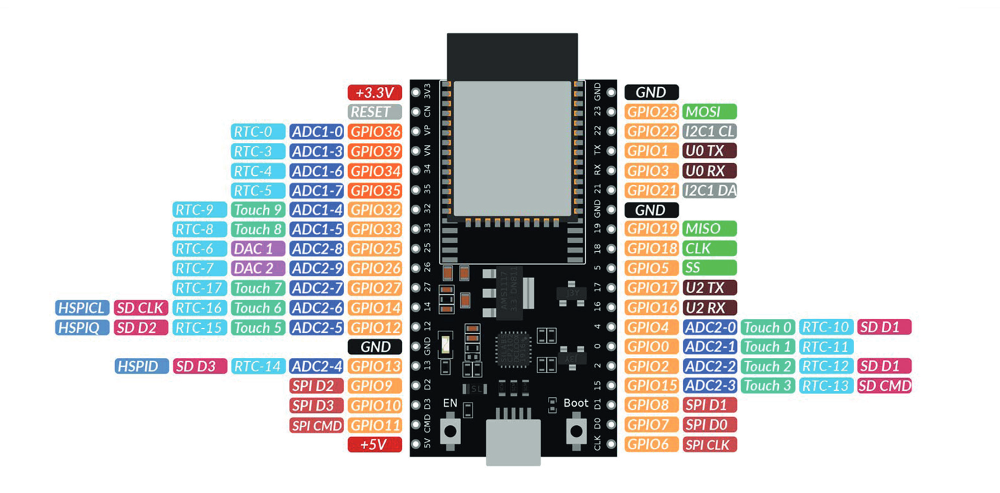
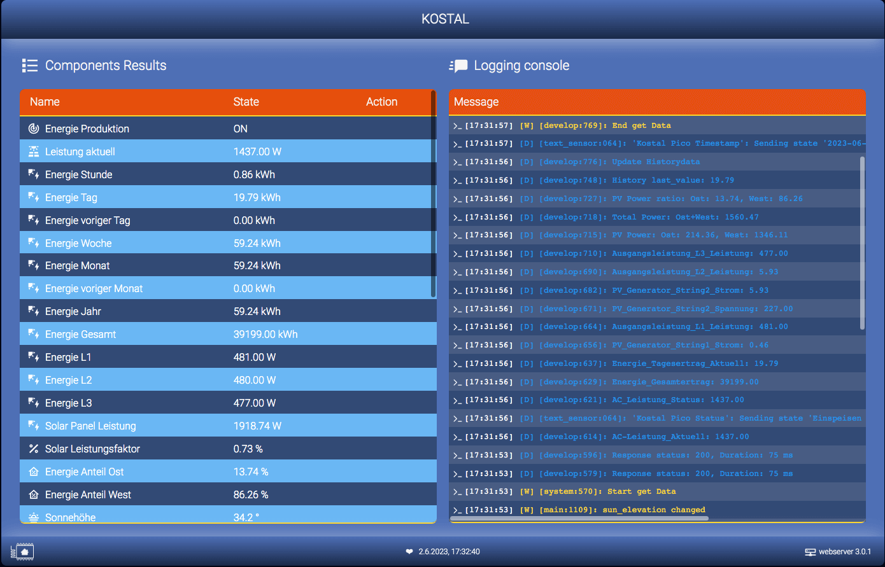

# KOSTAL PIKO 5.50 - ESPHome - ESP32 (v4) 

[![License][license-shield]][license]
[](https://github.com/zibous/ha-kostal-piko-esp/releases)
[![ESPHome release][esphome-release-shield]][esphome-release]
[![Open in Visual Studio Code][open-in-vscode-shield]][open-in-vscode]
[![Support author][donate-me-shield]][donate-me]


[license-shield]: https://img.shields.io/static/v1?label=License&message=MIT&color=orange&logo=license
[license]: https://opensource.org/licenses/MIT

[esphome-release-shield]: https://img.shields.io/static/v1?label=ESPHome&message=2023.5.5&color=green&logo=esphome
[esphome-release]: https://GitHub.com/esphome/esphome/releases/

[open-in-vscode-shield]: https://img.shields.io/static/v1?label=+&message=Open+in+VSCode&color=blue&logo=visualstudiocode
[open-in-vscode]: https://open.vscode.dev/zibous/zibous/ha-kostal-piko-esp

[donate-me-shield]: https://img.shields.io/static/v1?label=+&color=orange&message=Buy+me+a+coffee
[donate-me]: https://www.buymeacoff.ee/zibous

The ESPHome application loads the data from the Kostal PIKO 5.5 inverter at cyclic intervals, determines the characteristic values and calculates the historical data. The data are transferred via the Homeassistant API interface.

### Requirements
- **ESPHOME** on Docker v2023.5.0-dev
- **ESP32** 240MHz, 520KB RAM, 4MB Flash (ESP32 AZ-DELIVERY-DEVKIT-V4)
  
- **ESPHOME** Configuration<br>
  [](https://github.com/zibous/ha-kostal-piko-esp/blob/main/esphome/config/kostal-piko.yaml)
<br>

## Results



### Update Values with HA Service

With the service development tool you can call every available service in Home Assistant. You can use the following service to reset the history values:

```yaml
service: esphome.kostal_piko_set_historydata
data:
  hour: 12.3
  yesterday: 12.3
  week: 12.3
  month: 12.3
  lastmonth: 12.3
  year: 12.3
```

<br>

____

### Used components

 - optional backup (zdzichu6969)
   <https://github.com/zdzichu6969/esphome-components>

 - optional syslog (TheStaticTurtle)
   <https://github.com/TheStaticTurtle/esphome_syslog>


